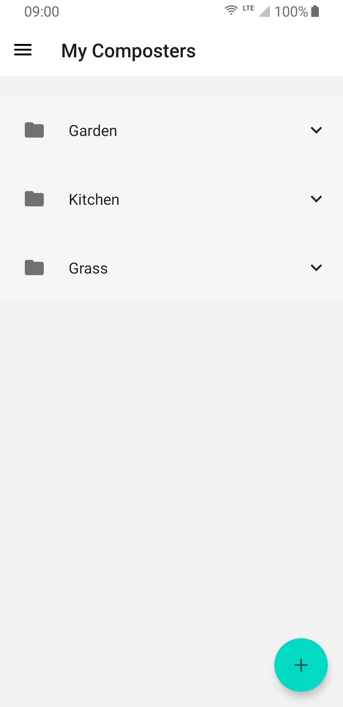
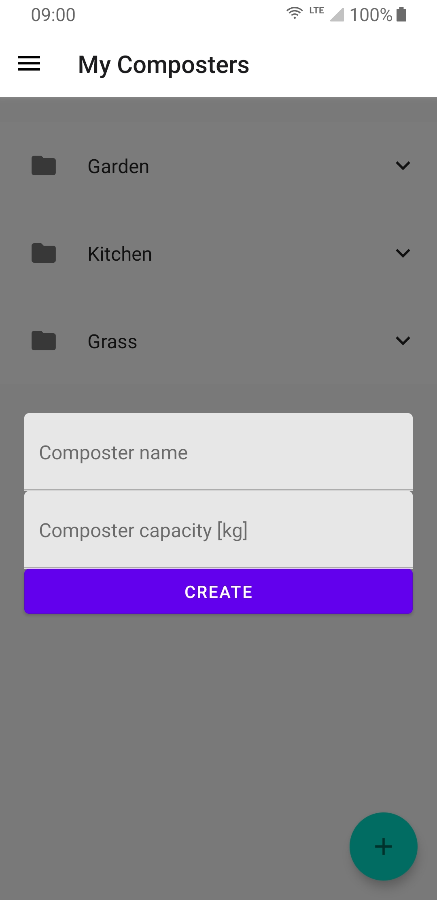
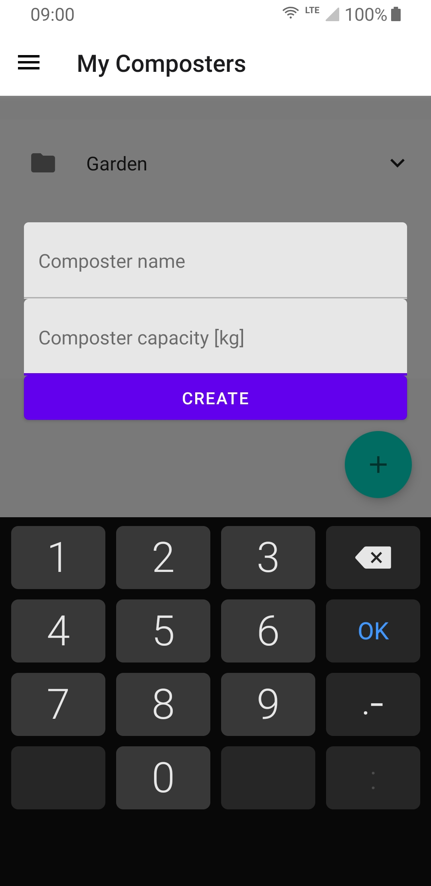
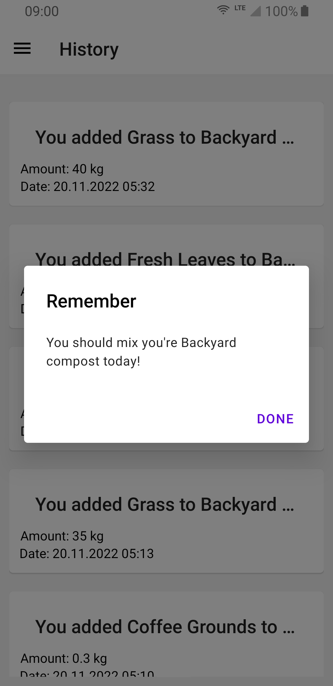
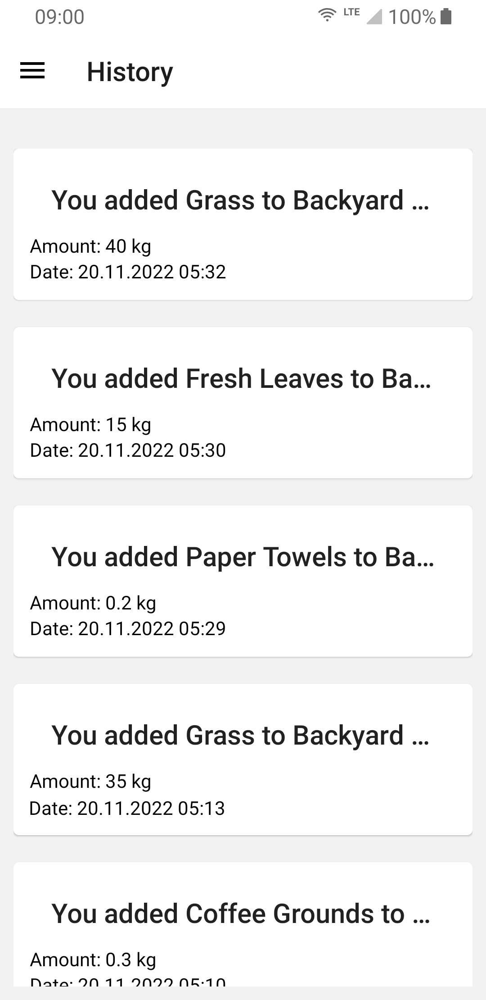
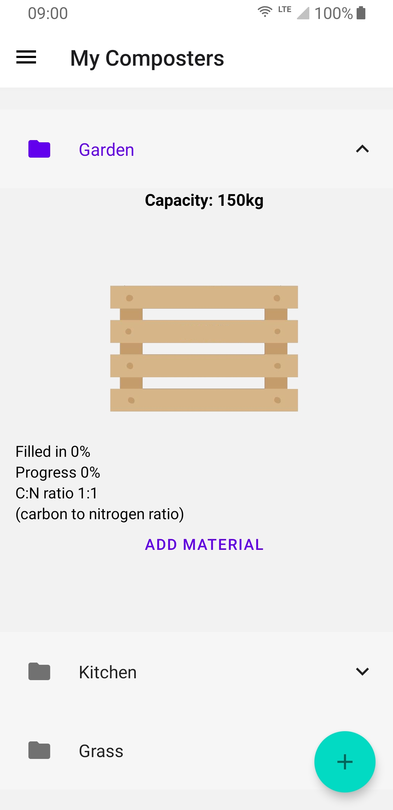
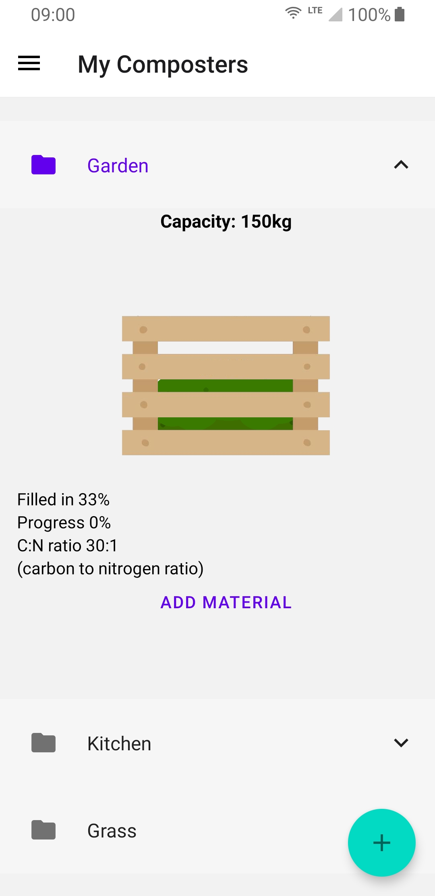
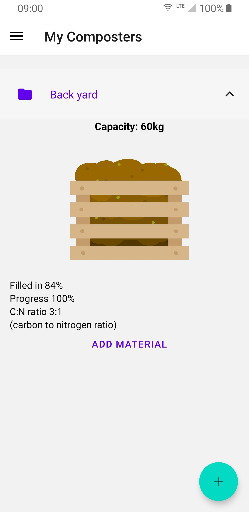
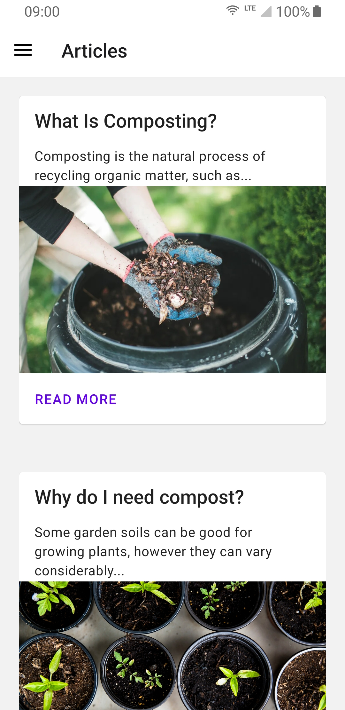

# Let's compost IT!

## What our project is all about?

Our solution is an attempt to reduce costs of managing and recycling compostable waste from polish households. It does not make much sense to pay for compostable waste management when you can compost it yourself very easily and use it for many things.

Our solution targets people living in rural and suburban areas.

## App functionality

Our app is mainly used to track progress of composters in your garden. You can create your virtual composters and keep track of your composting progress.

The app gives you reminders when to mix your compost or when to water it.

It also keeps a history of every ingredient that you put in the composter. By storing this, it can calculate statistics for the entire composter, so you will always know when it is ready to be used.

You can also be sure of the quality of your homemade compost, as our app calculates the Carbon to Nitrogen ratio. You can compare it to the optimal value for general purpose compost or target for ratios for specific plants.

Our app contains an education section with articles about homemade composting.

<!-- ## WOW! effect

We hope for maximum points in the WOW! effect category. We imaging the jury would do a backflip and say: "wow! this is so shitty". -->

Authors: Maciej Opaliński, Jakub Żojdzik  
Akademickie Liceum Ogólnokształcące Politechniki Wrocławskiej
